# 検証ログ・経緯の詳細（2026-08-30）

このプロジェクトで行った検証の詳細な記録。「今何をすべきか」の要点は [`docs/handoff.md`](handoff.md) を見ること。こちらは各検証の生データ・数値・解釈の経緯を追いたいときに参照する。

各知見の見出しにある `#N` は下の結果表の行番号に対応する。

## これまでの検証結果まとめ

| # | 条件 | ログファイル | サンプル数 | 主な所見 |
|---|------|-------------|-----------|----------|
| 1 | 近くに座る→歩いて離れる→戻る（1回目） | `logs/device-monitor-260830-074808.log` | 334 | RSSIが離れると明確に下がり、戻ると回復。再現性のある綺麗な信号 |
| 2 | 同上（2回目、再現性確認） | `logs/device-monitor-260830-075044.log` | 263 | 1回目とほぼ同じ傾向を再現 |
| 3 | 椅子に座っている（近い） | `logs/device-monitor-260830-075648.log` | 624 | rssi std=1.99, avg_amp std=2.63, diff_score mean=13.63 |
| 4 | 椅子近くのベッドで寝ている（近い） | `logs/device-monitor-260830-075738.log` | 547 | rssi std=1.19, avg_amp std=1.25, diff_score mean=11.13 |
| 5 | ESP32から離れた状態 | `logs/device-monitor-260830-075814.log` | 377 | rssi std=0.95, avg_amp std=0.65, diff_score mean=11.00 |
| 6 | （フィルタ追加前の追加ログ、未分析） | `logs/device-monitor-260830-080833.log` | 2020 | `filt=`フィールドなし＝MACフィルタ実装前の記録 |
| 7 | 椅子に座っている（MACフィルタ適用後） | `logs/device-monitor-260830-081303.log` | 1450+ | `filt=`が最初から最後まで100%（フィルタが一度も何かを除外しなかった） |
| 8 | S3(車iot・椅子付近, AP~1m)⇔C3(XIAO, ベッド頭付近, AP~2.5-3m) 同時記録、移動あり（11:06:30離席→玄関方向、11:09:25椅子に復帰） | `logs/device-monitor-s3-260830-110525.log`, `logs/device-monitor-c3-260830-110525.log` | S3:5877, C3:5976 | S3のrssiは今回の移動にほぼ無反応（過去の#1,2と食い違う。歩行経路がS3からの距離をあまり変えなかった可能性）。一方C3側は復帰の瞬間から+7〜8dB・30〜40秒持続するrssi上昇を観測（椅子から離れた場所なのに反応。部屋全体のマルチパス変化が波及した可能性、ただし1試行のみで要再現確認）。diff_scoreの3σスパイクはどちらの機器・イベントでもほぼ検出できず |
| 9 | S3(車iot)⇔C3(XIAO) 同一地点に並べて静止、機器差の切り分け用（動きなし） | `logs/device-monitor-s3-260830-111551-sameloc.log`, `logs/device-monitor-c3-260830-111551-sameloc.log` | S3:5873, C3:5977 | 同一地点でもrssiに約12dBの差（S3:-53.72 vs C3:-41.76）。avg_amp std（S3:1.76 vs C3:0.35）、静止時にもかかわらずdiff_scoreの3σスパイクが発生する率（S3:11/5873=0.19% vs C3:0/5977=0%）ともS3が明確に悪い。車iot機の自作PCBトレースアンテナが原因という仮説 |
| 10 | M5AtomS3 Lite(市販・内蔵3Dアンテナ)⇔C3(XIAO, 市販・外付けアンテナ) 同一地点に並べて静止 | `logs/device-monitor-atoms3-260830-112735-sameloc.log`, `logs/device-monitor-c3-260830-112735-sameloc.log` | AtomS3:5872, C3:5975 | rssi差が2.3dBまで縮小（AtomS3:-40.29 vs C3:-42.55）、diff_score平均もほぼ同一（11.34 vs 11.32）、3σスパイク率もS3:0.07%/C3:0.13%と同程度。#9で見えた12dB差は**チップ（ESP32-S3 vs C3）の差ではなく、アンテナ実装（自作低品質PCBトレース vs 量産品の設計されたアンテナ）の差**だったと確認できた（訂正2026-08-31：AtomS3 Liteのアンテナは外付けではなく内蔵3Dアンテナ。「外付けか内蔵か」ではなく「自作の未検証実装か量産品の設計品か」が分離軸） |
| 11 | AtomS3(椅子付近)⇔C3(XIAO, ベッド頭付近) 実運用ゾーン配置、離席→玄関方向→復帰を2回（11:45:15/11:46:17, 11:47:05/11:47:50） | `logs/device-monitor-atoms3-260830-114426-zone.log`, `logs/device-monitor-c3-260830-114426-zone.log` | AtomS3:5881, C3:5983 | クリーンな機体だと#8よりはっきり反応が出た。**C3（遠いノード）は離席中ずっとrssiが7〜8dB下がり復帰で回復**という持続的シフトを2回とも再現。**AtomS3（近いノード）は離席中ほぼ無反応、復帰の瞬間だけ一時的にrssiが落ちる**（着席動作による近接場の乱れ、数秒で回復）。同じ移動イベントでも近いノードと遠いノードで反応の質的パターンが異なる。diff_scoreは終始ノイズの帯のようで、このイベントを判別する材料にはならなかった。グラフ：`docs/images/zone_test_260830_leave_return.png` |
| 12 | AtomS3(椅子付近)⇔C3(XIAO, ベッド頭付近) 椅子→ベッド→椅子を2回（12:05:05/12:06:20, 12:07:05/12:08:24） | `logs/device-monitor-atoms3-260830-120424-tobed.log`, `logs/device-monitor-c3-260830-120424-tobed.log` | AtomS3:5874, C3:5977 | #11とは逆に、**人がC3(ベッド)に近づく**移動。C3のrssiは1回目-48〜-53、2回目-58〜-62と、**近接時ほど大きく・かつ一定しない**下降を見せた（#11の在室/不在の一定した下げ幅とは異質。近接場での体遮蔽が支配的になった可能性）。AtomS3(椅子から離れている間)はむしろ平坦で安定、椅子に戻る瞬間だけ一過性の乱れ（今回は上振れ、#11では下振れで方向は逆だが「戻る瞬間だけ乱れる」点は共通）。**diff_scoreは今回、AtomS3側にt=130〜155付近で明確なスパイクの帯が出た**（#11では終始ノイズに埋もれて見えなかった）。グラフ：`docs/images/zone_test_260830_tobed.png` |
| 13 | AtomS3⇔C3 自由行動（椅子/ベッド/玄関を不規則に行き来、約30分）。WiFi UDPでサブキャリア別振幅(192本)を連続送信、スマホの位置報告アプリでラベル記録 | `tools/csi_listener/data/csi_subcarrier_260830-124720.csv`, `tools/csi_listener/data/position_260830-124720.csv` | AtomS3:36064, C3:36689（位置ラベル別に分割済み） | サブキャリア別振幅のプロファイルを位置ラベルごとに平均し、機体内のばらつき(std)に対する位置間の差(RMS)を比較。**AtomS3は「玄関」を椅子・ベッドの両方からはっきり分離（1.3〜1.6倍）、椅子とベッドの区別は弱い（0.56倍）。C3は逆に「椅子」を分離できる（0.9倍）が、ベッドと玄関の区別が弱い（0.38倍）**。単一スカラー(rssi/avg_amp)では見えなかった構造。間取り図で位置関係を確認したところ、**C3・椅子・ルーターがほぼ一直線に並ぶ配置**だと判明し、「ノード↔ルーター間の直接伝搬経路を人体が遮ったかどうか」が主要因という仮説が浮上（詳細は下記知見）。グラフ：`docs/images/subcarrier_position_260830.png` |
| 14 | AtomS3を意図的に「ベッド↔ルーター直線上」へ再配置し、経路遮蔽仮説（#13）を直接検証。玄関→椅子→ベッド(横になる,約3.5分)→（椅子復帰直前、C3だけ遮りAtomS3は遮らない位置に数秒移動）→椅子 | `tools/csi_listener/data/csi_subcarrier_260830-134001.csv`, `tools/csi_listener/data/position_260830-134001.csv` | 記録全体でCSI 17,001行 | **仮説を支持する結果**：①ベッドで横になっている間(約3.5分)、AtomS3のrssiは-53〜-54で終始安定して低く、経路遮蔽が持続していたことを示唆（#11/#13時点でのAtomS3⇔ベッドの弱い分離(0.56倍)と対照的）。②椅子復帰直前、C3だけを狙って遮る位置に移動した数十秒間、**C3のrssiは下がり(-50→-52.55)、AtomS3のrssiは同時に上がる(-53.16→-48.58)という逆方向の変化**が起きた。ただし遮蔽区間の開始・終了を位置報告アプリでタップしていなかったため正確な区間切り出しはできておらず、大まかな傾向の確認にとどまる。グラフ：`docs/images/pathblock_260830.png` |
| 15 | 布団のみによる経路遮蔽 vs 人体による遮蔽の比較。#14と同じ配置のまま、人はベッドを離れ椅子へ（掛け布団だけがAtomS3↔ルーター経路上に残った状態）、約60秒記録 | `tools/csi_listener/data/csi_subcarrier_260830-135811.csv` | AtomS3:1778, C3:1808 | #14の`chair`(経路が空)・`bed_main`(人+布団)と3方向比較。**C3では布団のみは椅子(経路が空の状態)にほぼ近い(0.82倍、区別つかないレベル)一方、ベッド(人+布団)とは明確に違う(2.19倍)**——C3の「ベッド」シグナルは布団でなく人体そのものが主要因と判明。**AtomS3では逆に、布団のみでもベッド(人+布団)にかなり近い(1.30倍)、椅子とは明確に違う(1.90倍)**——AtomS3↔ルーター経路上では布団自体の物理的な質量だけでかなりの遮蔽が起きており、人体の追加寄与は相対的に小さい。近接場(C3)は水分を多く含む人体特有の効果が支配的、経路遮蔽(AtomS3)は物体の材質を問わず質量があれば起きる、という解釈と整合する。グラフ：`docs/images/blanket_only_260830.png` |
| 16 | #15の続き。布団をできるだけAtomS3↔ルーター経路から避けて再配置（人は変わらず椅子）、約60秒記録 | `tools/csi_listener/data/csi_subcarrier_260830-140406.csv` | AtomS3:1481, C3:1506 | **狙った効果は確認できず、別の交絡が見つかった**：AtomS3のサブキャリアプロファイルは布団を避けても`blanket_on`とほぼ同じ(1.36倍、ノイズレベル)のままで、椅子とは相変わらず違う(2.31倍)——ベッドのフレーム/マットレス自体が主な遮蔽要因で、布団単体の寄与は小さい可能性。**さらにrssiを見ると、C3・AtomS3の両方が`blanket_on`→`blanket_clear`間で同時に+6〜8dB上昇していた**（C3のいる場所・条件は変えていないはずなのに動いた）。これは布団の位置ではなく、2セッションの間（約6分）に起きたAP側の変化（レート制御・チャンネル状況など、#7で既知の外的要因）が両ノードに共通して乗った可能性が高い。今回の6分間隔の2点測定だけでは、布団の効果とこの共通ドリフトを切り分けられていない。グラフ：`docs/images/rssi_timeline_blanket_260830.png` |
| 17 | #14, #15, #16のrssi生データを再利用し、`rssi(C3) - rssi(AtomS3)`の差分を1秒ビンで時系列化（新規記録なし、既存データの再解析） | （#14, #15, #16と同じCSVを再利用） | main:431ビン, blanket_on:91ビン, blanket_clear:76ビン | **差分にすると共通ドリフトが打ち消され、状態分離もより明確になった**：#14メインセッションで椅子/玄関(+4〜+5)→bed_main(+2.5〜+3.5)→bed_block(-4〜-5)という3段階のプラトーがくっきり分離。#16で見つかった共通ドリフト(+6〜8dB)は、差分だと`blanket_on`=-3.43→`blanket_clear`=-1.72という1.7dBの変化に圧縮され、ほぼキャンセルされていた。グラフ：`docs/images/rssi_diff_timeline_260830.png` |
| 18 | C3をルーターとの中間点に椅子が来るよう再配置（椅子までの距離を詰め、フレネルゾーン理論に基づき分離度向上を狙う）。椅子→不在→椅子、各30秒程度 | `tools/csi_listener/data/csi_subcarrier_260830-150134.csv`, `tools/csi_listener/data/position_260830-150134.csv` | C3: chair1=211, away=437, chair2=1213 / AtomS3も同数程度 | **理論通り劇的に改善**：C3のchair-away rssi差は-6.63dB、雑音比5.22倍（#13時点では椅子の分離比0.9倍程度だった）。AtomS3も3.47倍とまずまず。**椅子→不在の移動中(t≈28-30秒)、C3が急上昇(-44→-38)すると同時にAtomS3が急降下(-46→-56)** という逆方向の同時変化が明確に観測できた（移動経路がAtomS3側の遮蔽を一瞬引き起こしたと考えられる）。椅子復帰時(t≈50-53秒)は逆に両方同時に沈む、また違うパターン。グラフ：`docs/images/new_c3_position_260830.png` |
| 19 | 位置推定の実地テスト。椅子/ベッド/玄関を各40秒キャリブレーション→自由に移動するテスト区間（アプリの位置報告を正解ラベルとして使用） | `tools/csi_listener/data/csi_subcarrier_260830-152601.csv`, `tools/csi_listener/data/position_260830-152601.csv` | キャリブレーション各40〜46秒、テスト区間約245秒（1秒ビン） | **#17までに確立した2つのスカラー特徴量（rssi差分＝静止位置、サブキャリア0〜50帯の乱れ＝移動検知と向き）だけで組んだ分類器**：①rssi差分の最近傍分類：全体50.8%、椅子recall84.5%だがベッドとentranceのキャリブレーション基準値がほぼ同値(4.69 vs 4.93)でベッドrecall0%。②rssi差分で「椅子/それ以外」を2値判定し、それ以外に入った瞬間のサブキャリア乱れの順序（C3が先→玄関、AtomS3が先→椅子/ベッド）で行き先を決めるハイブリッド方式：**移動イベント単位では4回中3回正解**したが、キャリブレーション直後の1回の誤判定が最長のベッド滞在(100秒)全体に伝播し、時間重み付き精度は51.8%に留まった。**試行錯誤の過程で、検証していないサブキャリア個別プロファイルやF比選抜など未検証の手法を持ち込んでしまい精度が悪化する失敗もあった**（既知の特徴量だけを忠実に使うことの重要性を再確認）。グラフ：`docs/images/position_classifier_v4.png`, `docs/images/position_classifier_v5.png` |
| 19b | #19のデータを再利用し、「椅子 vs それ以外」の2値判定に絞った場合の精度と、判定結果が数秒連続したら確定させる（デバウンス）処理の効果を検証（新規記録なし） | （#19と同じCSVを再利用） | テスト区間245ビン | **2値に絞ると92.7%まで跳ね上がった**（椅子recall87.1%、それ以外recall100%）。3値分類の50.8%から大幅改善——「椅子は分離できるがベッド/玄関は弱い」という一連の知見通りの結果。**デバウンス（k秒連続で確定）はk=1（デバウンスなし）が最良で、k秒を増やすほど単調に悪化**（k=20で70.6%）。原因はグラフで判明：誤分類18件は移動タップの直前に集中しており、**センサーが実際の離席をアプリのタップより数秒早く検知している**ことが原因（ノイズではなく正解ラベル側の反応遅延）。デバウンスは遷移検知の遅延コストだけが乗り、ノイズ除去のベネフィットがないため逆効果になった。グラフ：`docs/images/chair_binary_debounce_260830.png` |
| 20 | S3を玄関へ向かう歩行経路上（人体が遮りそうな位置）へ再配置。椅子↔玄関を3往復、椅子↔ベッドを2往復、計11回の移動イベント | `tools/csi_listener/data/csi_subcarrier_260830-162357.csv`, `tools/csi_listener/data/position_260830-162357.csv` | 約210秒、11区間 | **AtomS3が「ゾーン占有センサー」から「通過検知（トリップワイヤー）センサー」に性質が変わった**：静止時のrssiは椅子/ベッド/玄関いずれも-39.9〜-40.5dBとほぼ同値（回ごとのばらつきstdも0.4〜0.5dBで差がない）で、行き先による弁別力がない。一方、サブキャリア0〜50帯の乱れは**11回の移動イベント全てでC3とほぼ同期したピークを見せた**（C3側は#18同様、行き先ごとに異なるレベルへ移行する挙動を維持）。ルーターとの直線上に「監視したいゾーン」を置く配置（#14, #18）とは異なり、直線上に「通過点」を置くと、滞在時間によらず通過の瞬間だけを検知する別種のセンサーとして機能する。グラフ：`docs/images/atoms3_tripwire_260830.png` |
| 20b | #20のデータを再利用し、#19bと同じ手法（rssi差分の最近傍分類、最初の椅子/玄関区間をキャリブレーションに使用）で「椅子 vs それ以外」の2値分類を試した（新規記録なし） | （#20と同じCSVを再利用） | テスト区間190ビン | **精度が92.7%(#19b)→80.5%に悪化**（椅子recall79.0%、それ以外recall83.1%）。誤分類はテスト中盤の椅子区間1つ・終盤の玄関区間1つが丸ごと逆判定される形で集中していた。AtomS3がトリップワイヤー化して静止時にゾーン間の差をほぼ出さなくなったため、特徴量`rssi(C3)-rssi(AtomS3)`が実質C3単体の値で決まるようになった。**1秒刻みで内訳を見ると2区間の原因は別物**（#20b追加検証）：中盤の椅子区間は最初9秒が正しく判定され、残り9秒（ベッドタップ直前）だけ誤判定——これは移動を始めてからアプリのタップが遅れた**ラベル遅延**（#19bと同種）。終盤の玄関区間は区間の真ん中12/14秒がまるごと椅子域に沈み込む**持続的な外れ値**で、こちらはC3側のセッション内ドリフト/外れ値が妥当な説明。#17で確認した「ノード間差分は共通ドリフトを打ち消す」という効果は、両ノードがそれぞれゾーン依存の変化を持つ場合にのみ機能していたことが裏付けられた形。グラフ：`docs/images/chair_binary_tripwire_260830.png` |
| 20c | #20のデータを再利用し、10回の移動イベントそれぞれについて「AtomS3のサブキャリア0〜50帯乱れのピーク値（タップ前後±3秒）」と「rssi差分の変化幅（前後5秒平均の差）」を突き合わせ、玄関がらみの遷移とベッドがらみの遷移を判別できるか検証（新規記録なし） | （#20と同じCSVを再利用） | 移動イベント10件 | **AtomS3の乱れピークだけで完全分離できた**：玄関がらみの遷移（6件）は乱れピーク3.10〜5.79（平均4.06）、ベッドがらみの遷移（4件）は1.61〜2.10（平均1.96）と、両群が重ならず、中間の閾値（3.01）1本で**10/10正解**。一方、rssi差分の変化幅（x軸）には玄関/ベッドどちらの群でも大小さまざまで、判別に寄与していなかった。AtomS3が玄関への経路上のトリップワイヤーとして機能しているため、その経路を横切る移動（玄関がらみ）だけを強く拾い、経路を通らない移動（ベッドがらみ）は弱くしか反応しない、という配置の物理と整合する。グラフ：`docs/images/tripwire_direction_check_260830.png` |
| 20d | #20cの閾値（3.01）を使い、「rssi差分で椅子/それ以外の2値判定→それ以外に切り替わった瞬間のAtomS3乱れピークで玄関/ベッドを決定」という2段構えのロジックを時系列全体（テスト区間190ビン）に対して実際に走らせ、3値（椅子/ベッド/玄関）分類として精度を検証（新規記録なし） | （#20と同じCSVを再利用） | テスト区間190ビン | **時間重み付き精度82.1%**（椅子recall81.5%、ベッドrecall100%、玄関recall61.3%）——#19の同種のハイブリッド方式（51.8%）から大幅改善。誤分類は新しい原因ではなく、**#20bで切り分けた2区間にそのまま起因**：t≈40〜59sの椅子区間はベッドタップのラベル遅延、t≈136〜151sの玄関区間はC3側の持続的な外れ値。2段目（方向判定）自体は、1段目が正しく遷移を検知できた場面では常に正解しており、#20cの10/10という切り分け精度がそのまま活きている。**この配置での実用上のボトルネックは方向推定ではなく、1段目のrssi差分判定を安定させること**（ラベル遅延自体はセンサー側の問題ではなく許容できるが、C3側の外れ値/ドリフトへの対策や再キャリブレーション頻度の検討が次の課題）とわかった。グラフ：`docs/images/tripwire_hybrid_classifier_260830.png` |
| 20e | #20bで見つかったC3のドリフト/外れ値（rssiレベルが誤って「椅子」判定を招くケース）を、C3単体のサブキャリア形状（絶対レベルを引いて形だけ残したもの）で補償できないか検証。leave-one-out（対象区間を除いた残りから椅子/それ以外テンプレートを作成）で形ベースの2値判定を試した（新規記録なし） | （#20と同じCSVを再利用） | 全11区間（キャリブレーション含む） | **狙った外れ値ケースを正しく補正できた**：rssiレベルのみのleave-one-out判定は9/11(81.8%)で、外れ値の玄関区間を「椅子」と誤判定していたが、**C3のサブキャリア形状ベースの判定は10/11=90.9%まで改善し、その外れ値区間も正しく「それ以外」と判定**できた（corr_chair=0.700 < corr_away=0.816）。ただし完全ではなく、代わりに別の区間（最後の39.8秒の椅子区間）で0.777 vs 0.783という僅差の逆方向の誤判定を新たに生んだ。全11区間という少数サンプルでの結果であり、再現性は未検証。グラフ：`docs/images/c3_shape_chair_binary_260830.png` |
| 20f | #20b/#20d/#20eでは#19bを踏襲して「最初の椅子/玄関区間をキャリブレーション」として使っていたが、**#20の収集自体にキャリブレーション設計はなく恣意的な分割だった**と判明。1秒ビン単位で「rssi差分のみ」「C3サブキャリア形状のみ」「OR（どちらかが椅子なら椅子）」の3方式を、leave-one-segment-out（各区間を1つ除いた残り全区間からテンプレート作成）に作り直し、全11区間・210秒全体で公正に比較（新規記録なし） | （#20と同じCSVを再利用） | 全222ビン（全区間） | **OR判定が総合精度では最良（85.1%）だが、バランスで見るとサブキャリア形状単体が有力**：rssi差分のみ82.0%（椅子recall79.3%/それ以外recall86.2%）、形状のみ82.9%（椅子recall73.3%/それ以外recall**97.7%**）、OR判定85.1%（椅子recall**85.9%**/それ以外recall83.9%）。ORは「どちらかが椅子と言えば椅子」という論理上、椅子recallは上がるがそれ以外recallは単体最良のrssi差分より下がるトレードオフがある。3方式とも大きな誤分類の帯はほぼ同じ2つのタイミング（t≈61〜79s, t≈157〜171s）に集中しているが、これは新しい原因ではなく**#20bで切り分け済みの2件がそのまま座標を変えて出ているだけ**——前者は椅子区間（#20bの試行区間でのt≈40〜59s相当）でベッドタップのラベル遅延、後者は玄関区間（同t≈136〜151s相当）でC3の持続的な外れ値。グラフ：`docs/images/c3_or_classifier_loo_260830.png` |
| 21 | M5Stack ATOM Lite（無印ESP32）を新規に3台調達し、同一機種3台構成で初の実機検証。配置：A=ルーター↔椅子↔ノードの延長線上（ゾーン占有）、B=部屋中央（椅子→玄関間のトリップワイヤー）、C=廊下接続部（同トリップワイヤー、Bと別地点）。椅子↔玄関を2往復、位置報告アプリでタップ | `tools/csi_listener/data/csi_subcarrier_log.csv`, `tools/csi_listener/data/position_log.csv` | A:2069, B:2066, C:1606（放置時点、疎通確認分）＋歩行テスト区間で3台合計約9000サンプル、約153秒 | **チップ非依存の再確認と、rssi移動平均による新しい方向判定手段の発見**。まず疎通確認：3台とも同一機種でもMACアドレスで正しく区別でき（`main.cpp`のUDPヘッダ・`listener.py`とも変更不要）、静止時のrssi平均は3台とも-48〜-51dBm・振幅平均19.4〜20.4とチップ間差なし（#8〜#10の知見と整合）。歩行テストでは、**ゾーン配置のAが椅子/玄関でrssi平均が-52〜-55 vs -59〜-61と3往復とも一貫して約7〜8dB分離**（#18と同種の結果を新ハードウェアで再現）。トリップワイヤーB・Cは`diff_score`（サブキャリア0〜50帯の要素ごと差分平均）だと常時ノイズ床が2〜6と高く、移動時のピーク（5〜12）が視覚的に埋もれて判別しづらかった。**そこで生データに1秒（20サンプル）移動平均をかけたところ、Aのdiff_scoreは平常時0.5〜1・移動時4〜5.5という明確な山に整理され、さらにB・Cのrssiにも各タップ時刻に同期した一時的な谷（-42台→-46〜-47台）が新たに視認できた**。この谷の発生順序を4回の遷移すべてで比較すると、**椅子→玄関の移動では常にB→Cの順、玄関→椅子では常にC→Bの順**と、見取り図上の物理配置（椅子側にB、廊下側にC）通りに完全一致（4/4）。#17・#18・#20cで確立していた「2ノード間の乱れの順序で移動方向がわかる」という知見を、**diff_scoreではなくrssiの移動平均という別の指標でも再現できた**のが今回の新しい収穫。グラフ：`docs/images/atomlite_abc_tripwire_direction_260903.png` |
| 22 | SpecificDeviceCSI（TX専用/RX専用、ESP-NOWブロードキャストまたはユニキャスト、USBシリアル転送）の初実装・実機検証。公式esp-csiのcsi_send/csi_recvをArduino/PlatformIOへ移植（`src/csi_tx.cpp`, `src/csi_rx.cpp`、新規env `m5atom-lite-tx`/`m5atom-lite-rx`）。A=RX、B=TX。段階的に9パターン切り分け：①AP非接続+promiscuous+ブロードキャスト（基本形）②チャンネル11固定確認 ③HT40→HT20変更 ④promiscuous有効化をCSI設定の前/後で入れ替え ⑤トラフィック（TX）をRX起動後に再起動 ⑥platform espressif32を6.13.0→7.1.0（より新しいESP-IDF）に上げる ⑦ブロードキャスト→TX/RX別MACでのユニキャストに変更 ⑧AP接続状態を維持したままユニキャスト（`secrets.h`の実家WiFiに接続） | ログファイルなし（シリアル出力を直接観察、`[heartbeat]`行でcsi_total_cb/csi_matched/promisc_total/promisc_matchedを2秒おきに記録） | 各パターンとも数千パケット分（TX送信100Hz×数十秒〜数分） | **「AP接続(アソシエート)済みであることがCSI取得の必要条件」と実機で確認できたが、SpecificDeviceCSIの目的（第三者デバイスのCSI取得）自体は解決しなかった**。①〜⑦は`promisc_total`（生受信）が常にTXの送信レート(100Hz)とほぼ一致して増え続けるのに対し、`csi_total_cb`（CSIコールバック発火）はほぼ常時0（3000パケット中1回発火した例が1件あるのみ）——電波受信は完璧なのにCSI抽出だけ働かない状態が一貫して再現した。espressif公式issue [esp-csi#247](https://github.com/espressif/esp-csi/issues/247)（「元祖ESP32はCSI有効化前から続くトラフィック・ブロードキャストのCSIを取りこぼす」）と症状が一致するが、そこに書かれた対策（トラフィック再起動）を試しても直らなかった。**⑧でAP接続状態にした結果、`csi_total_cb`が毎秒約23回のペースで増加し始め、CSIハードウェア自体は動くことを確認**——「未接続状態ではCSIがほぼ動かない」という仮説の前半は実証された。しかし`csi_matched`（TX由来、偽装MAC宛のユニキャスト）は数千パケット送信中わずか6件のみで頭打ちになり、`csi_total_cb`の大半は`last_unmatched_mac`に表示される実在のMAC（推定：接続先APやその配下の他端末）由来だった。**つまり元祖ESP32のCSIハードウェアは「現在アソシエート中のBSSIDに紐づくフレーム」を優先的に処理する設計と考えられ、AP接続していても第三者デバイス（TXのような未アソシエートの相手）からの直接パケットはほぼ拾えない**。この制約はSpecificDeviceCSIだけでなく、同様に「AP接続したまま他デバイスのトラフィックからCSIを取る」ことを要求するInterDeviceCSI（4.2）にも及ぶ可能性が高い（未検証）。公式ドキュメント・調査したissueのどこにも明記されていない、実機検証で初めて確認できた制約 |

## 得られた知見

- **粗い位置変化（歩いて近づく/離れる）**：RSSIの平均値シフトだけで十分検出できる。#1, #2で再現性を確認済み
- **能動的な動作（座って作業中の体動）**：`diff_score`の散発的なスパイクとして拾える。#3では離れた状態の3σを超えるスパイクが624サンプル中18回（2.9%）発生していたが、#4（寝ている）・#5（離れた）では0回
- **静止していても在室/不在を区別できるか（当初の本命課題）**：#3〜#5で「座っている > 寝ている > 離れた」という綺麗な段階的パターンがrssi/avg_amp両方の標準偏差に現れた。特にavg_ampの標準偏差は寝ている(1.25)が離れた(0.65)の約2倍あり、じっとしていても在室/不在の違いが信号の"揺らぎの大きさ"に出ている可能性がある。**当初のPIRセンサーでは検知できない「静止した在室状態」を拾えるかもしれない、という意味で初期段階で一番の収穫だった一節**（その後#13〜#18でサブキャリア分解・経路遮蔽仮説・フレネルゾーン理論による配置最適化・移動方向推定と、より具体的で実用度の高い知見が積み上がっているので、現時点では数ある収穫の1つという位置づけ）
- **MACフィルタの実験結果（#7）**：CSIコールバックの送信元MACをAPのBSSIDに絞るフィルタを追加したが、採用率は常に100%だった。つまり「同一チャンネル上の他端末の通信を誤って拾っていた」という仮説は誤りで、STAモードのWiFiドライバは元々AP由来のフレームしかCSIコールバックに渡していなかったと考えられる。これにより、残っているノイズ（ルーターの自動レート制御・再送・ビームフォーミングなど）はAP側の挙動に起因するもので、**ESP32側だけでは制御できない**ことが裏付けられた
- **チップ差 vs アンテナ実装差（#8〜#10、2026-08-30）**：car-iot機（自作PCBアンテナ）とXIAO C3（市販・外付けアンテナ）を同一地点に並べても約12dBのrssi差が出た（#9）。しかしcar-iot機の代わりに市販品のM5AtomS3 Lite（同じくESP32-S3だが内蔵3Dアンテナ、量産品として設計されたアンテナ）で比較し直すと差はわずか2.3dBまで縮小し、diff_scoreの平均・3σ誤検知率もほぼ同水準になった（#10）。**ESP32-S3とESP32-C3自体のCSIセンシング特性に大きな差はなく、car-iot機の信号品質の悪さはアンテナ実装（自作PCBトレース）に起因する**と判断できる（訂正2026-08-31：当初「外付けアンテナ同士の比較」と記載していたが、AtomS3 Liteのアンテナは外付けではなく内蔵の3Dアンテナ。分離軸は「外付けか内蔵か」ではなく「自作の未検証実装か量産品の設計品か」）
- **近いノードと遠いノードで移動イベントへの反応パターンが質的に違う（#11、2026-08-30）**：クリーンな機体（AtomS3・XIAO C3）で椅子からの離席→復帰を2回行ったところ、**遠いノード（C3、ベッド頭付近）は離席中ずっとrssiが7〜8dB下がる持続的なレベルシフト**を示し、**近いノード（AtomS3、椅子付近）は復帰の瞬間だけ数秒間rssiが落ちる一過性の反応**を示した。2サイクルとも同じパターンが再現している。`diff_score`は終始高いノイズの帯になっていて、この程度の歩行イベントを判別する材料としては機能していない（グラフで一目瞭然）

  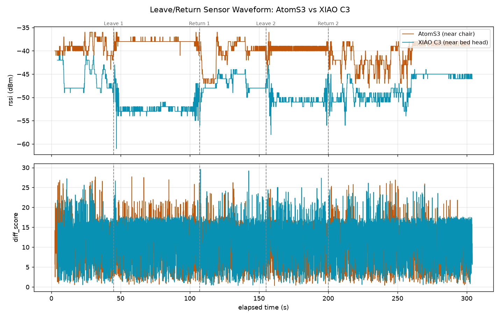

- **「離れた場所への移動」と「近づく移動」で反応の質がさらに違う（#12、2026-08-30）**：#11は椅子からベッドと無関係な玄関方向への移動だったが、#12では逆に**人がC3(ベッド)自体に近づく**移動を試した。結果、C3のrssiは#11のような一定した下げ幅ではなく、**近接時ほど大きく・かつ試行ごとにばらつく**下降（1回目-48〜-53、2回目-58〜-62）を見せた。人体がアンテナのごく近くにあることによる**近接場の遮蔽効果**が、単純な在室/不在の差より支配的になっていると考えられる。また`diff_score`も#11では終始ノイズに埋もれていたが、#12ではAtomS3側にt=130〜155付近で明確なスパイクの帯が出た。**`diff_score`はノードの近くでの動きにしか反応せず、`rssi`は近接時の体遮蔽と遠隔時の在室/不在とで異なる質の変化を示す**、という構造が見えてきた

  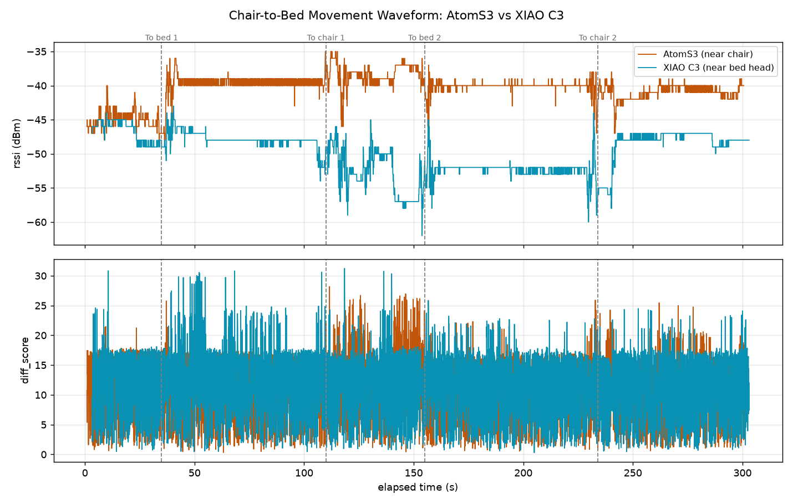

- **サブキャリア別振幅なら位置ごとに分離できる兆しがある（#13、2026-08-30）**：単一スカラー(rssi/avg_amp)ではなく、CSIバッファをサブキャリアごとに`sqrt(I²+Q²)`で正しく振幅計算し（WiFi UDPでPCへ送信、詳細はhandoff.mdの「ツール構成」）、約30分の自由行動データを位置ラベル（椅子/ベッド/玄関）ごとに平均・比較した。結果、**AtomS3は「玄関」を椅子・ベッドの両方から明確に分離（機体内ばらつきの1.3〜1.6倍）**、**C3は「椅子」を分離（0.9倍）**できたが、AtomS3の椅子vsベッド、C3のベッドvs玄関はそれぞれ分離が弱かった（0.56倍, 0.38倍）
  - 間取り図で位置関係を確認したところ、**C3・椅子・ルーターの座標がほぼ一直線上に並ぶ配置**だと判明（C3→ルーター直線上での椅子位置の予測誤差はわずか7px程度）。これにより、**「ノード↔ルーター間の直接伝搬経路（フレネルゾーン）を人体が遮ったかどうか」が支配的要因**という仮説が立つ：C3にとって椅子は自分↔ルーター経路の真上にあるため人が座ると強く遮る一方、ベッド(近接場)と玄関(遠方)はどちらもその経路の"外"にあるため似た影響になり分離しにくい。AtomS3はルーター・げんかんの開口部の近くにいるため、玄関への行き来がAtomS3↔ルーター経路を横切りやすく、玄関が一番分離できる、という説明も筋が通る
  - **未検証の仮説**：今回は自由行動1回きりの間取りからの逆算であり、直接確認していない。同じ距離でも経路の内側/外側に意図的に立って比較すれば切り分けられる
  - 生データにはLTFセグメント継ぎ目のアーティファクト（規則的な0埋め区間・単発の異常スパイク）が乗るため、解析時は除外が必要（`docs/images/subcarrier_position_260830.png`は除外済み版）
  - **物理的な裏付け（フレネルゾーン）**：2.4GHzの波長は約12.5cm。障害物が電波を遮るかどうかは波長そのものより、送受信点間の距離にも依存する第1フレネルゾーン半径`F1=√(λ・d1・d2/(d1+d2))`（d1,d2は障害物から送受信点それぞれまでの距離）で決まる。今回の部屋スケール（ノード↔ルーター間5m程度、障害物が中間）だとF1≈40cm。人体（胴回り30〜40cm）はこの太さと同程度かそれ以上あり見通し線周辺の"通り道"を実質的に塞ぐサイズだが、布団は同じ2次元的な影の位置にあっても3次元的な体積の占有量・誘電損失（水分含有量）が小さく、遮蔽効果が弱い（#15の結果と整合）

  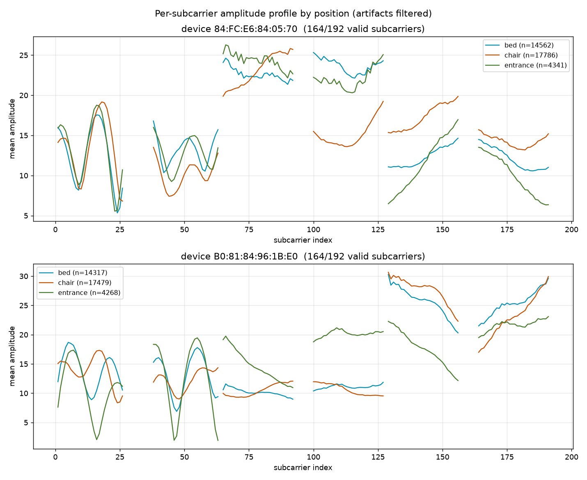

- **経路遮蔽仮説（#13）の直接検証、結果は支持的（#14、2026-08-30）**：AtomS3を「ベッド↔ルーター直線上」に意図的に再配置して検証。**横になっている間(約3.5分)AtomS3のrssiが-53〜-54で終始安定して低く**、それまでの弱い分離（AtomS3のベッドvs椅子=0.56倍）とは対照的な"持続的に遮られている"状態が見えた。さらに、椅子復帰直前に**C3だけを狙って遮る位置**へ数十秒移動したところ、**C3のrssiは下降(-50→-52.55)、AtomS3は逆に上昇(-53.16→-48.58)**という、狙い通り逆方向の変化が同時に起きた。経路遮蔽仮説を支持する結果と言えそう
  - **反省点**：遮蔽区間の開始・終了を位置報告アプリでタップし忘れたため、正確な区間の切り出しができず「だいたい直前15秒」で近似する必要があった。次回ピンポイントな遮蔽テストをするときは、遮蔽の開始/終了もアプリでタップすること

  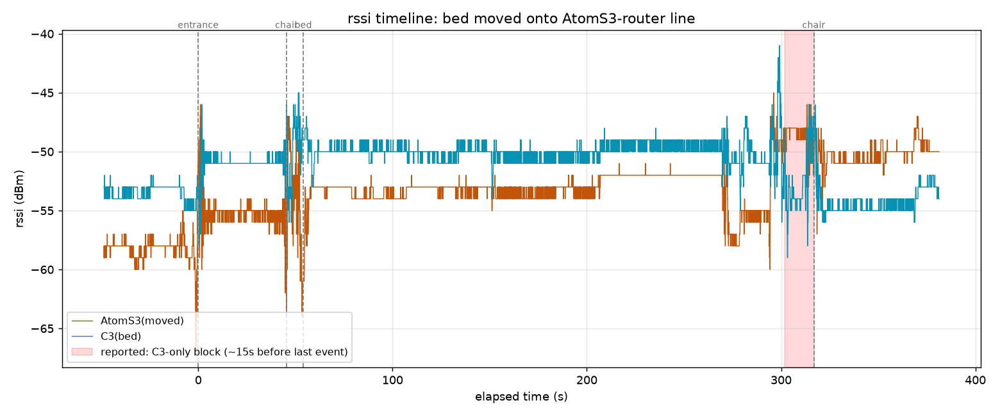

- **サブキャリア分解で見ると、C3側は椅子/ベッド/部分遮蔽の3段階がきれいに分離した（#14追加解析）**：#14のデータを「chair（玄関タップ前も含め椅子にいた区間）」「bed_main（横になっている大半）」「bed_block（C3だけ狙って遮った終盤）」の3群に分けてサブキャリア別振幅を比較したところ、C3では特定の帯域（サブキャリア65〜92, 100〜127）で**bed_main > bed_block > chair という順序がほぼ重ならないレベルで一貫していた**。経路遮蔽の強さ（chair=経路上で最も強く遮蔽、bed_main=近接場のみで経路は空いている、bed_block=部分遮蔽）と対応する段階的な変化に見える。ただし残り2帯域（130〜157, 165〜192）ではこの順序が崩れており、LTFセグメント（Legacy/HT/STBC-HT）によって信頼度が異なる可能性がある。AtomS3側では、経路上にあるbed_mainが他から離れる帯域で、bed_block（AtomS3の経路は避けた操作）がchairに近づく傾向が見え、意図した操作と整合していた

  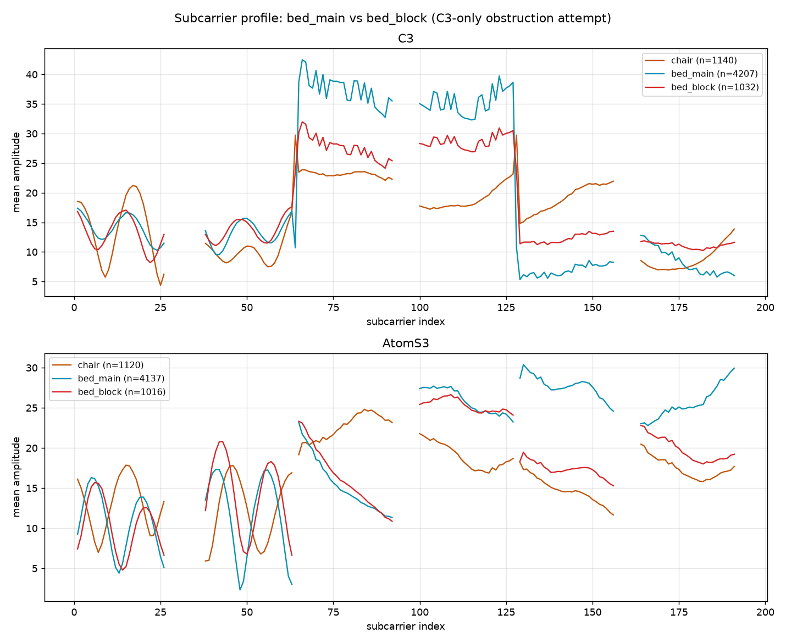

- **近接場(C3)と経路遮蔽(AtomS3)は「何が効くか」が違う——布団だけでは人体の代わりにならない場合とそうでない場合がある（#15、2026-08-30）**：#14の直後、人がベッドを離れ布団だけが残った状態（AtomS3↔ルーター経路上）を60秒記録し、`chair`（経路が空）・`bed_main`（人+布団）と3方向比較した。**C3では「布団のみ」は「椅子」にほぼ近く(0.82倍)、「ベッド(人+布団)」とは明確に違った(2.19倍)**——C3はベッド頭付近にあり、寝た状態でも人体がC3↔ルーター間には入らない配置のため、C3の「ベッド」シグナルは近接場での人体特有の効果（水分を多く含む組織の誘電特性）が主要因で、布団という物体の存在自体はほぼ無関係だとわかる。**AtomS3では逆に「布団のみ」が「ベッド(人+布団)」にかなり近く(1.30倍)、「椅子」とは明確に違った(1.90倍)**——AtomS3↔ルーター経路上に物理的な質量があること自体が主要因で、材質（布 vs 人体）の違いは相対的に小さい。実用上の含意：**近接場配置（C3型）は物体を人体と誤検知しにくいが、経路遮蔽配置（AtomS3型）は経路上の物（布団・荷物等）を人体と誤検知するリスクがある**

  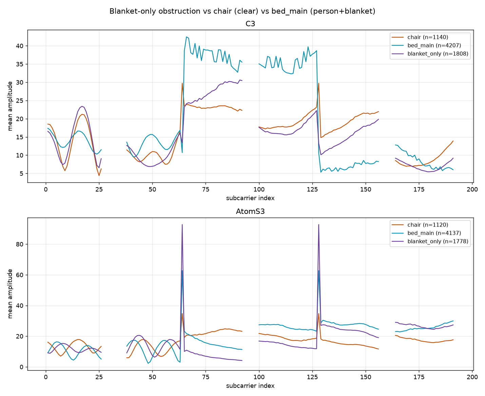

- **2ノード同時ドリフトに要注意（#16、2026-08-30）**：布団をAtomS3経路から避ける追試を行ったところ、狙った変化（AtomS3のプロファイルが椅子側に戻る）は確認できず、代わりに**C3・AtomS3の両方のrssiが約6分の間隔を挟んだ2セッション間で同時に+6〜8dB上昇する**という想定外の動きが見つかった。片方のノード（C3）の周辺環境は変えていないと申告されており、これは物理的な操作ではなく**AP側の何かが両ノードに共通して影響した**と考えるのが妥当（#7で確認済みの「ESP32側では制御できないノイズ」の一種）。**複数ノードを比較するときは、同時に記録された条件同士でないと、こうした共通ドリフトを個別の物理効果と誤認しかねない**という教訓が得られた

  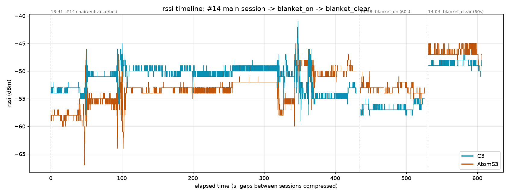

- **rssiの絶対値でなく「ノード間の差分」を見ると、共通ドリフトを打ち消しつつ状態がよりくっきり分離する（#17、2026-08-30）**：#16で見つかった共通ドリフト問題への対策として、`rssi_C3 - rssi_AtomS3`の差分を1秒ビンで時系列化した。**#14メインセッションだけで3段階のプラトーがくっきり分離**：椅子/玄関(経路が空)で+4〜+5、ベッドで横になっている間(bed_main)で+2.5〜+3.5、C3だけを狙って遮った瞬間(bed_block)で-4〜-5まで転落——生のrssiより明確な段差として見える。**布団の追試（#16）でも、生のrssiでは+6〜8dBの共通ドリフトに埋もれていた変化が、差分だと`blanket_on`=-3.43→`blanket_clear`=-1.72という1.7dBの変化として抽出できた**（共通ドリフトはほぼキャンセルされている）。**実用上の指針**：複数ノード構成でのゾーン判定は、各ノードの絶対rssiより「ノード間の差分」を特徴量にする方が、AP側の共通ノイズに対して頑健になりそう

  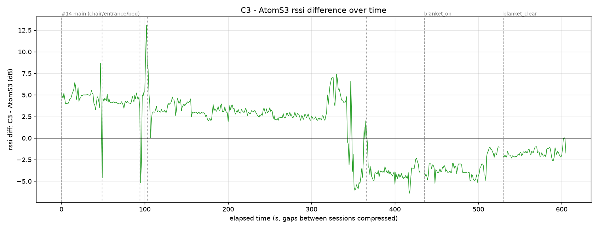

- **移動の瞬間ごとに差分に鋭い山谷が出る。ノードの遮蔽切り替えとして説明できる区間とできない区間がある（#17追加検証、2026-08-30）**：#14の3つの移動イベント（椅子→玄関、玄関→椅子→ベッド、C3遮蔽解除→椅子復帰）それぞれの前後を0.5秒ビンで拡大した。**椅子→玄関**、**玄関→椅子→ベッド**の2区間は、「どちらのノードが遮られているか」の切り替わりとして説明のつく鋭い山→谷（またはその逆）のパターンがはっきり出た（例：玄関→椅子→ベッドでは、椅子タップ直後に-6.4まで急降下、ベッドタップ直前に+14まで急上昇）。一方**C3遮蔽解除→椅子復帰**の区間は、深いマイナス(-5〜-7.7)からゼロ付近をうろつく曖昧な遷移を経て、最終的に-4に落ち着くだけで、はっきりした「S3遮蔽」フェーズは見当たらなかった。**さらに、この区間の落ち着いた後の値(-4)は、同じ「椅子」のはずのセッション最初の値(+4〜5)と符号ごと逆転しており、約6分のセッション内でも#16のような共通ドリフトが起きていたことを示唆する**。「移動の瞬間が鋭い変化として現れる」こと自体は再現性高く使えそうだが、ドリフトを考慮しないと解釈を誤る

  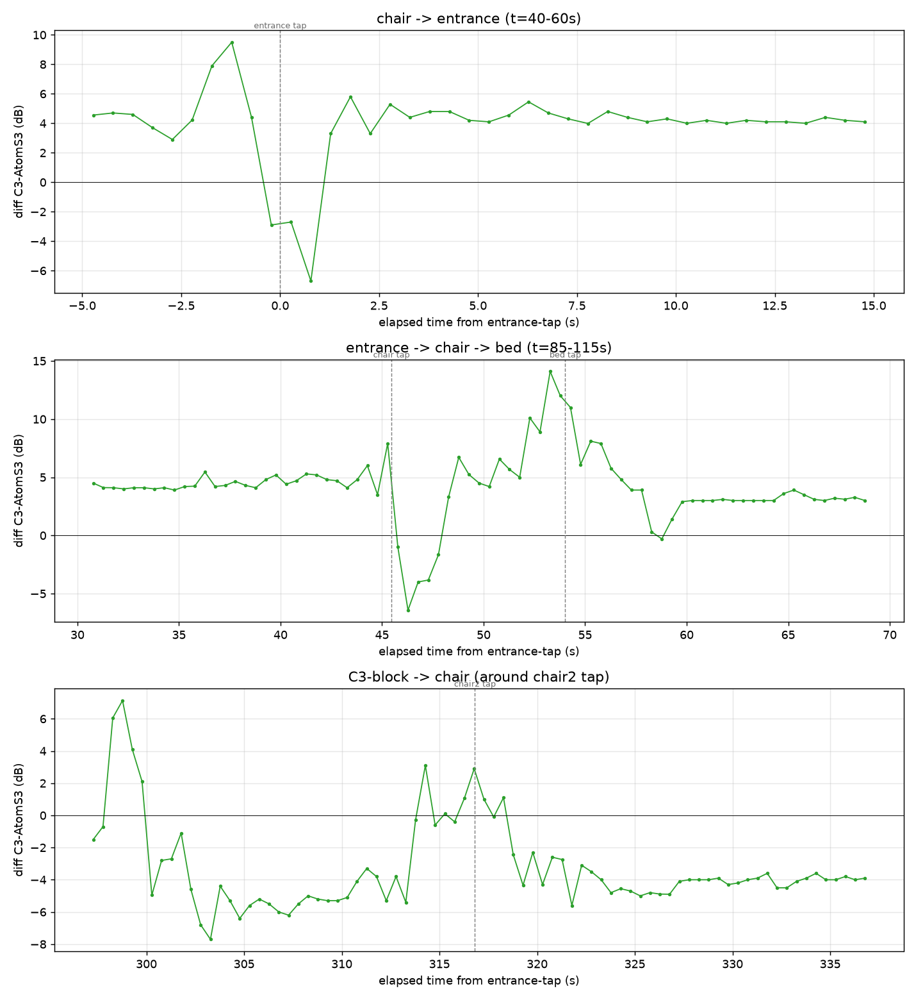

- **上記3区間をサブキャリア分解すると、区間ごとに解釈できる度合いが違う**：before/during/afterの各フェーズでサブキャリア別振幅プロファイルを比較した。**椅子→玄関**は帯域によってbefore/during/afterの高低順序が入れ替わり、単純な強弱ではなく周波数選択性フェージングの違いとして現れていた。**玄関→椅子→ベッド**が一番きれいで、C3の特定帯域で**bed_main(最高) > during(ベッドタップ直前) > before > during(椅子タップ,最低)**という順序が一貫しており、「椅子タップの瞬間に最も強くC3を遮蔽し、ベッドに近づくほど解ける」という物理的なストーリーと合致した。**C3遮蔽解除→椅子復帰**は「after(chair2)」が他の2フェーズよりくっきり高く分離して見えるが、この区間は前述の通りセッション内ドリフトと絡んでいる疑いが強く、物理的な遮蔽効果として鵜呑みにはできない

  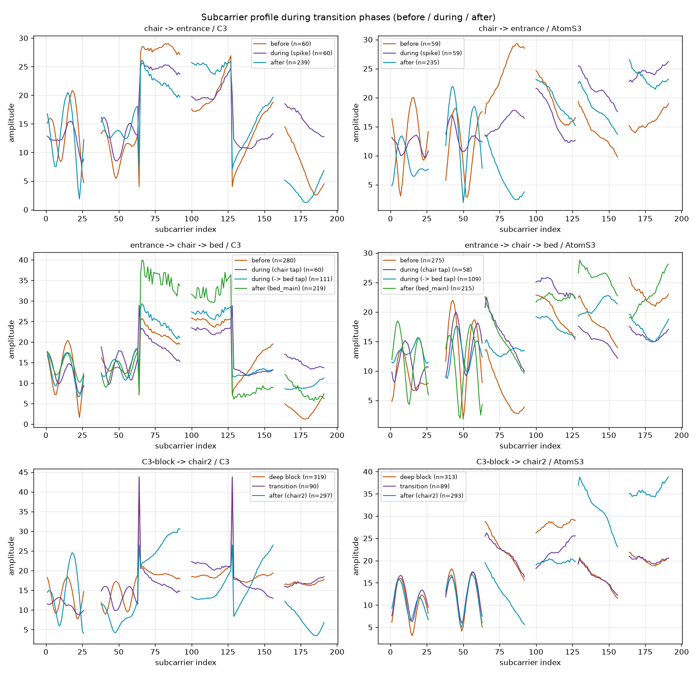

- **サブキャリアを時間×周波数のヒートマップにすると、位相平均では潰れていた「立ち上がりのタイミング・持続時間」まで見える**：3区間それぞれで、横軸=タップ基準の経過時間、縦軸=サブキャリア番号、色=振幅というヒートマップを作成した。**区間1（椅子→玄関）**ではタップの2〜4秒前（実際に歩いている最中）に65〜127帯が一時的に明るくなり、AtomS3の方がC3よりわずかに早くピークが来ていた。**区間2（玄関→椅子→ベッド）**では、AtomS3がベッドタップ直前(t=8〜14秒)に130〜157帯で鋭い一過性のバーストを見せた後、C3側は少し遅れて65〜127帯が持続的に明るい帯として立ち上がりbed_mainの状態に移行していく様子が、位相平均では分からなかった時間差として見えた。**区間3（C3遮蔽解除→椅子復帰）**はAtomS3の130〜192帯がt=5〜15秒で緩やかに（一過性でなく）明るくなり定着しており、これがセッション内ドリフトなのか物理効果なのかは依然判別できないが、少なくとも変化の性質（急変でなく数秒かけて定着）は分かった

  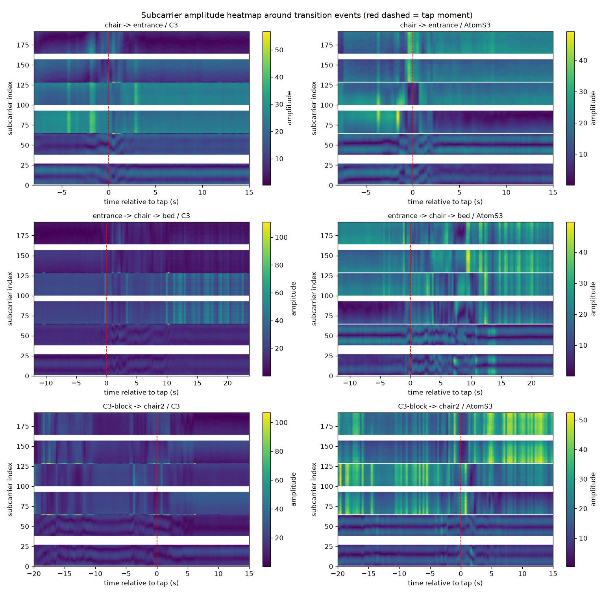

- **rssi差分とヒートマップは必ずしも一致しない**：両者を同じ時間軸で縦に並べて見比べたところ、区間1・2ではdiffのピーク（+10, +14）がヒートマップの明るいバーストとだいたい同じタイミングで出ていたが、**diffの急降下（タップ前後の-6〜-7）に対応する明確なヒートマップ変化は見当たらなかった**（両ノードのピークタイミングが数百ms〜1秒ずれていることによる相対的な差分アーティファクトの可能性）。区間3ではAtomS3のヒートマップがタップ後にはっきり明るくなっているのに、diffはほとんど反応しなかった（C3側も同時に似た変化をして相殺された可能性）。**diffという1つのスカラーは、両ノードが同時に似た変化をすると消えてしまい、サブキャリアが持つ豊かな情報を代表しきれない**という限界が見えた

  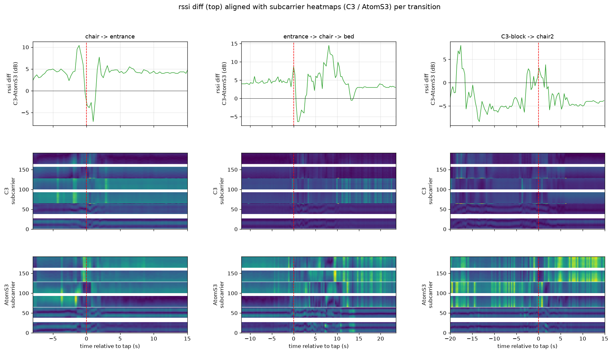

- **サブキャリア0〜50帯の"乱れ"（フレーム間差分）が、タップの瞬間に鋭く反応する——`diff_score`低迷の原因と改善案が見えた**：ユーザーの目視観察（「0〜50帯が乱れているタイミングが遮蔽と一致している気がする」）を、その帯域だけに絞った前フレーム差分の平均値として定量化したところ、3区間すべてでタップ前後±1〜2秒にはっきりしたスパイクが出た（例：区間2ではbaseline0.5〜1に対し椅子タップの瞬間に両ノード同時に跳ね上がり、AtomS3は7.1に到達。さらにAtomS3だけベッドタップに近づくt=7〜14秒にも追加のバーストが2回）。**これまで使ってきた`diff_score`（192本全帯域の平均）が終始ノイズに埋もれて動きを判別できなかった（#11〜#14）のは、差分という考え方自体の問題ではなく、LTFセグメント境界のアーティファクトや無効サブキャリアを含む帯域全体を平均していたことが原因だった可能性が高い**。対象帯域を絞るだけで`diff_score`の実用性が大きく改善するかもしれない——ファームウェア側の`diff_score`計算をサブキャリア0〜50帯限定にする、という具体的な改善案が得られた

  **サブキャリア0〜50帯の正体**：`main.cpp`の`wifi_csi_config_t`は`lltf_en`/`htltf_en`/`stbc_htltf2_en`を全て有効にし`ltf_merge_en`で連結しているため、192本は3種類のトレーニングシンボル（各64サブキャリア＝802.11 20MHzチャネルの標準FFTサイズ）が順に並んだもの：0〜64=**Legacy LTF**、65〜127=HT-LTF、130〜192=STBC-HT-LTF（各セグメント中央の28〜37等はDCヌル/ガードで無効）。0〜50帯はこのうちLegacy LTFにあたる。L-LTFはHTかどうか・MCS/レートに関わらずあらゆるWiFiフレームに必ず同じ形式で含まれる最も基本的なトレーニングシンボルである一方、HT-LTF/STBC-HT-LTFはAPがHTフレーム・特定MCSを選んだ時だけ意味を持つ、AP側の状態に左右されやすいフィールド。#7で確認した「残るノイズはAP側のレート制御に起因する」という知見と合わせると、**HT-LTF/STBC-HT-LTF帯はAPのレート制御変化に巻き込まれてノイズが乗りやすく、L-LTF帯はAP状態に依存しない分、動きによる実際のチャネル変化がより素直に見えていた**、という解釈が成り立つ

  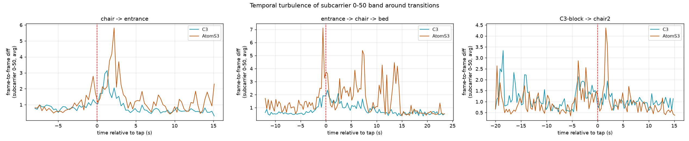

- **フレネルゾーン理論に基づくノード再配置で、分離度が劇的に改善した（#18、2026-08-30）**：2.4GHzの波長(12.5cm)・フレネルゾーン半径の計算（`F1=√(λ・d1・d2/(d1+d2))`）から、「障害物(椅子)をノード↔ルーター間の中間点に置き、かつ全体の距離を詰めるとフレネルゾーンが縮んで人体が占める割合が増え、分離がくっきりする」という予測を立て、C3を実際にその配置に動かして検証した。結果、**C3のchair-away rssi分離比は0.9倍(#13)→5.22倍に劇的改善**。理論の実測での裏付けが取れた。また椅子→不在の移動中に**C3急上昇とAtomS3急降下が同時に起きる**瞬間も観測でき、移動経路がAtomS3側の遮蔽も一瞬引き起こすことを確認した

  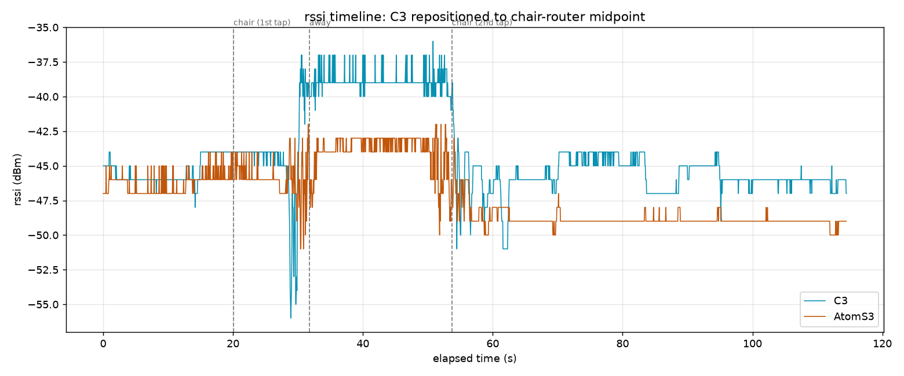

- **「移動の向き」はサブキャリアの乱れの順序、「今どこにいるか」はrssi差分のレベルで表せる——2つを組み合わせた簡易トラッキングの可能性（#18追加検証、2026-08-30）**：#18のデータでrssi差分とサブキャリア0〜64帯のヒートマップを縦に並べたところ、diffの急降下(-8)と同時にAtomS3の38〜64帯に明確な暗いスジが見えるなど、diffとサブキャリアレベルの変化が対応する場面が確認できた。一方で、AtomS3の0〜27帯は2回目の椅子復帰後にはっきり暗く沈むのに、diffのグラフには対応する動きがなく、**diffだけではサブキャリアの変化を代表しきれない**という#17の教訓も再確認された

  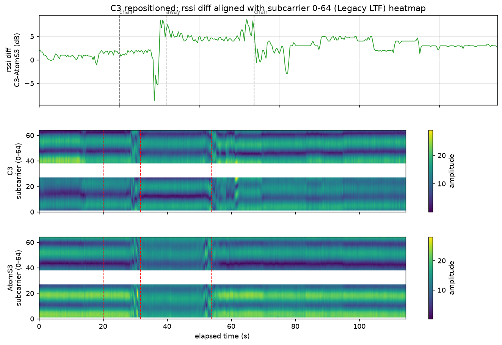

  さらに、目視観察（「椅子→不在はC3の乱れの直後にS3の乱れ、不在→椅子はS3の乱れの直後にC3の乱れがあるように見える」）をサブキャリア0〜50帯の前フレーム差分のピーク時刻として定量検証したところ、**椅子→不在ではC3が先(タップの1.9秒前)・AtomS3が後(0.7秒前)、不在→椅子ではAtomS3が先(2.3秒前)・C3が後(1.3秒後)**と、移動の向きによって乱れの順序がきれいに反転することを確認できた。C3が椅子寄り・AtomS3がルーター寄りに配置されている今の幾何とも整合する。**「移動の検知＋向きの推定」はサブキャリアの乱れの順序で、「静止時の位置」はrssi差分のレベル（プラトー）で担い、両者を組み合わせれば人がどこからどこへ動いたかを追跡できる可能性がある**——今日一連の発見（経路遮蔽仮説、diff_scoreの帯域限定、rssi差分の状態分離）を統合する形の知見

- **位置推定の実地テスト（#19、2026-08-30）**：#17までに確立した2つのスカラー特徴量（rssi差分＝静止位置、サブキャリア0〜50帯の乱れ＝移動検知/向き推定）だけを使い、実際にキャリブレーション→テストという形で位置推定を試した。rssi差分のみの最近傍分類は50.8%（椅子は84.5%当たるがベッドと玄関の基準値がほぼ同値でベッドrecall0%）。移動方向を組み合わせたハイブリッド方式は、**移動イベント単位では4/4検出・4回中3回で行き先の向きが正しく判定できた**が、状態を一度決めたら維持し続ける設計のため、最初の1回の誤判定が最長滞在区間(100秒)全体に伝播し、時間重み付き精度は51.8%に留まった。**試行錯誤の途中で、検証していない手法（サブキャリア個別プロファイルをそのまま高次元特徴量にする、F比による個別サブキャリア選抜）を持ち込んで精度が悪化する失敗もあった**——確立済みの知見だけを忠実に使うことの大切さを再確認した回でもある

- **「椅子にいるかどうか」の2値判定なら92.7%、デバウンスは逆効果（#19b、2026-08-30）**：3値（椅子/ベッド/玄関）分類は50.8%だったが、**「椅子 vs それ以外」の2値に絞ると92.7%**（椅子recall87.1%、それ以外recall100%）まで跳ね上がった。さらに「判定結果が数秒連続したら確定」というデバウンス処理を試したところ、**k=1（デバウンスなし）が最良で、閾値を上げるほど単調に精度が悪化**した（k=20秒で70.6%）。原因を可視化すると、誤分類は実際の移動タップの直前に集中しており、**これはノイズではなく「センサーが実際の離席をアプリのタップより数秒早く検知している」ため**と判明——正解ラベル（人間がボタンを押すタイミング）自体に反応遅延があり、デバウンスはその遅延をさらに積み増すだけで、フィルタすべきノイズがそもそも存在しなかった。**シンプルな2値・都度判定が今のところ一番実用的**という結果

  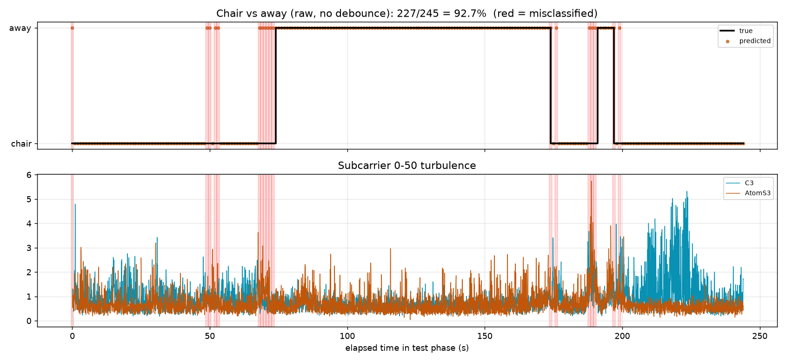

  実際に誤分類区間（18件）とAtomS3のサブキャリア乱れ（2σ超）を突き合わせたところ、**18件全部が乱れのピークと重なっていた**（100%一致）。さらにこの乱れをキャリブレーション区間も含めた全体（1秒/3秒/5秒/10秒の移動平均、4パターン）で可視化すると、キャリブレーション内の区切り（ベッド→玄関、玄関→椅子=テスト開始）でも同じようにピークが立っており、**テスト区間だけでなくキャリブレーション中の移動でも同じ現象が一貫して見られた**。移動平均の窓を広げるほど単発ノイズは減るが立ち上がりが緩やかになり遅延も増える——ここでも debounce と同様のトレードオフが見て取れる。3秒/5秒あたりが単発ノイズの抑制と反応速度のバランスが良さそうに見えたため、**判定結果(上段)・rssi差分の生値(中段、椅子/それ以外の基準線つき)・C3とAtomS3の乱れの3秒/5秒移動平均(下段)を1つの図に重ねた**。中段のrssi差分が基準線をまたぐタイミング、下段の乱れのピーク、上段の誤分類（赤網掛け）が、ほぼ全ての遷移できれいに揃っている。さらに上段の「true」表示を、2値(椅子/それ以外)だけでなく**ベッド(青)・玄関(紫)を色分けした3値の実ラベルも重ねて**見えるようにした——ベッド区間は持続的に高いrssi差分を保つ長い滞在として、玄関区間は短時間の訪問として、視覚的に区別がつく

  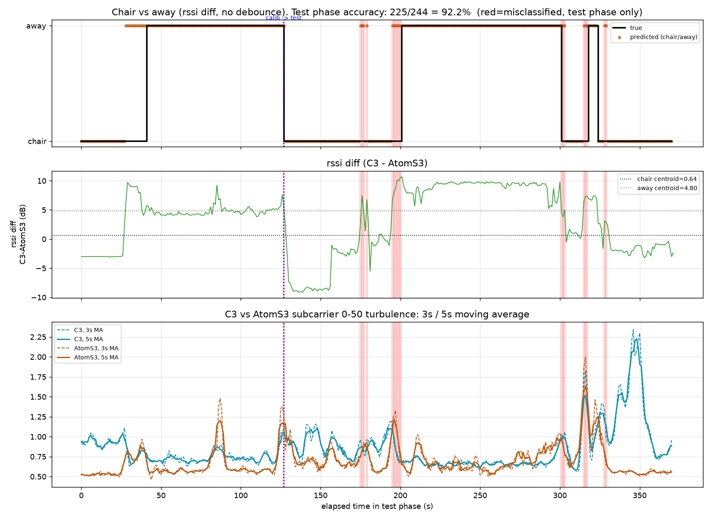

  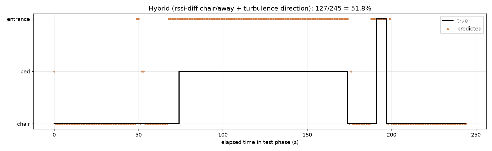

- **HAの玄関モーションセンサーとのクロスバリデーション（2026-08-30）**：Home Assistant連携はまだ本格導入していないが（MCP経由でGetLiveContextのみ利用可）、既存の「開閉センサー F2 モーション」（エリア「室内」、名前は紛らわしいが玄関付近を検知するセンサー）の履歴をユーザーがHA画面で確認したところ、**15:27・15:31に動体検出があり、#19のテストで玄関にいた時刻（15:27:54〜15:28:34、15:31:44〜15:31:50）とほぼ一致**した。椅子・ベッドの時刻では検出が出ておらず、このセンサーが玄関付近だけをカバーしているという当初の前提（プロジェクトの出発点）とも整合する。**アプリでの位置タップが実際の行動を正しく反映していたことの独立した裏付け**が取れた。ただし、HAの「アクティビティ」（ロジックブック）表示では同じセンサーの15:27・15:31のイベントが見当たらず11:56:24で途切れており、**HA内部でも履歴ビュー間でデータの欠損・不整合がある**ことが分かった。今後HAとの本格連携をする際は、このデータ欠損問題も考慮する必要がある

  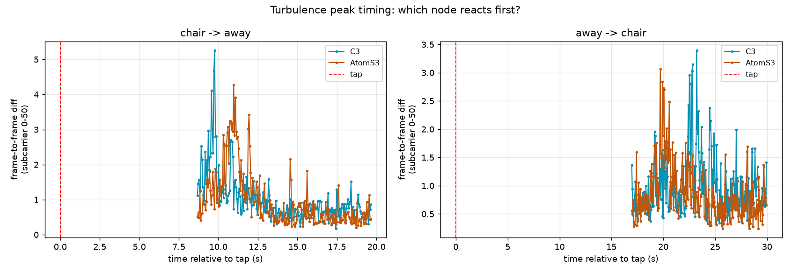

- **静止時でも`diff_score`の3σスパイクは偶発的に発生する（#9, #10）**：動きが全くない状態でも、車iot機で0.19%、M5AtomS3 Liteで0.07%、XIAO C3で0〜0.13%の割合で3σを超えるスパイクが発生した。将来`diff_score`を動き検知の閾値判定に使う場合、この誤検知ベースラインを踏まえた閾値設計が必要
- **1台のノードでも、その場所から離れた場所での人の動きに反応することがある（#8、要再現確認）**：椅子の近くから離れた場所（ベッド頭付近）に置いたXIAO C3が、椅子への「復帰」イベントの瞬間から+7〜8dB・30秒以上持続するrssi上昇を示した。物理的に近接していない場所での行動が、部屋全体のマルチパスを通じて別ノードのCSI/rssiに影響する可能性を示唆するが、1試行のみでノイズとの区別がついていない

- **ノードの設置意図で「ゾーン占有センサー」にも「通過検知センサー」にもなる（#20、2026-08-30）**：#14・#18ではノード↔ルーター直線上に「留まる場所（ベッド・椅子）」を置き、滞在中ずっと持続するrssiレベルシフトを得ていた。今回はAtomS3を「玄関へ向かう際に人体が通る場所（滞在せず通過するだけの地点）」に置いたところ、**静止状態でのrssiはゾーンによらずほぼ一定（-39.9〜-40.5dB、std0.5以下）になり、ゾーン判定の材料としては機能しなくなった**。しかし移動の瞬間だけはC3と同様にサブキャリア0〜50帯の乱れが鋭く反応しており（11/11のイベントで確認）、rssiレベルでの滞在判定ではなく「今まさに人がそこを通過した」というイベント検知として使える。**同じ物理原理（経路遮蔽）でも、ノードをどこに置くかで得られる情報の性質（滞在 vs 通過）が変わる**、という設置設計上の知見

  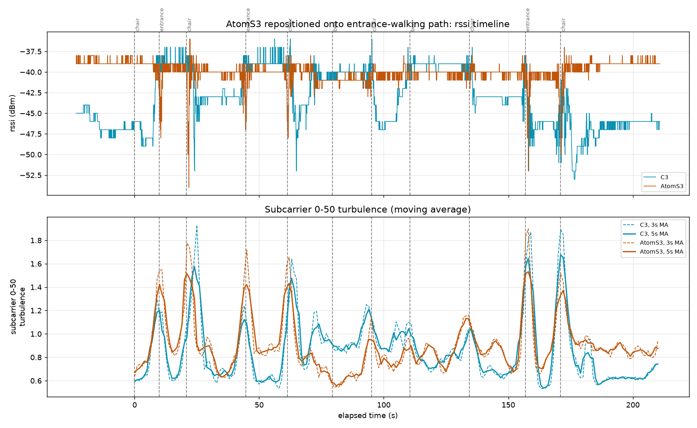

- **トリップワイヤー配置は「静止位置の2値判定」には不利——ノード間差分によるドリフト打ち消し効果が失われる（#20b、2026-08-30）**：#20のデータに#19bと同じ「椅子 vs それ以外」分類器（rssi差分の最近傍判定）をそのまま適用したところ、**精度が92.7%(#19b)から80.5%に悪化**した。誤分類はテスト中盤の椅子区間1つと終盤の玄関区間1つがまるごと逆判定される形で集中していた。特徴量`rssi(C3)-rssi(AtomS3)`が実質C3単体の値で決まるようになったことが背景だが、**1秒刻みで内訳を見ると2区間の原因は別物だった**（追加検証）：中盤の椅子区間は最初9秒がdiff=-4〜-9で完全に正しく判定され、残り9秒（ちょうどベッドタップ直前）だけ0付近に浮いて誤判定——これは移動を始めてからアプリのタップが遅れた**ラベル遅延**で、#19bで確認済みの「センサーがタップより先に反応する」現象と同種であり、センサーの誤りではない。一方、終盤の玄関区間は最初と最後の1秒だけ正しく、**真ん中12/14秒がまるごと椅子域(-5〜-7)に沈み込む持続的な外れ値**で、こちらは境界のズレでは説明できず、C3のセッション内ドリフト/外れ値という当初の解釈が妥当。#17で「ノード間差分は共通ドリフトを打ち消す」と確認していたが、**それは両ノードがそれぞれゾーン依存の変化を持つ場合にのみ機能する前提条件付きの効果**だったと分かった。**同じ経路遮蔽の原理でも、設置目的（滞在検知 vs 通過検知）によって2値分類器としての向き不向きが逆転する**——通過検知に向く配置は、静止位置の判定精度をむしろ下げるトレードオフがある

- **トリップワイヤーの乱れピークの大きさで、移動が玄関がらみかベッドがらみかを完全に判別できた（#20c、2026-08-30）**：ユーザーの仮説（「rssiの差が大きく変動したときに、一定以上SCの乱れがあるかどうかで玄関方向への移動かがわかりそう」）を検証。10回の移動イベントそれぞれでAtomS3のサブキャリア0〜50帯乱れのピーク値（タップ前後±3秒）を求めたところ、**玄関がらみの遷移（6件、乱れ3.10〜5.79・平均4.06）とベッドがらみの遷移（4件、乱れ1.61〜2.10・平均1.96）が完全に分離**し、中間の閾値1本（3.01）で**10/10正解**した。一方、仮説後半にあった「rssi差分の変化幅が大きいときに限定する」という条件は不要と判明——変化幅の大小（-5.4〜+6.4dBとまちまち）は玄関/ベッドどちらの群にも表れており、判別に寄与していたのは乱れピークの大きさだけだった。AtomS3が玄関への経路上のトリップワイヤーとして機能しているため、その経路を横切る移動だけを強く拾い、経路を通らない移動は弱くしか反応しない、という設置の物理と整合する。**「椅子かどうか」はrssi差分（#20bで80.5%）、「玄関方向かベッド方向か」は移動時のAtomS3乱れピークの大きさ、という2段構えの分類ロジックが有望**

  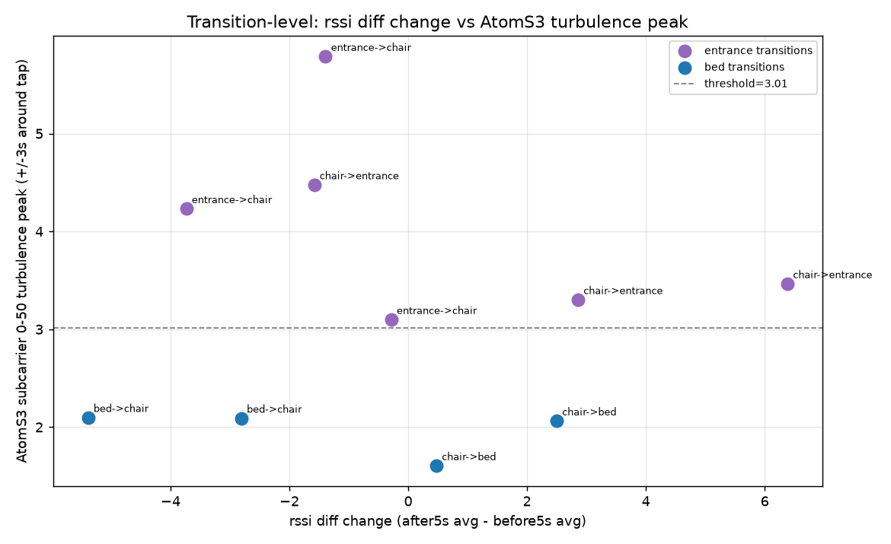

- **2段構えのハイブリッド分類器を時系列全体に適用すると82.1%——ボトルネックは方向推定ではなくrssi差分側の1段目（#20d、2026-08-30）**：#20cの閾値をもとに「rssi差分で椅子/それ以外を判定→それ以外に切り替わった瞬間のAtomS3乱れピークで玄関/ベッドを決定」というロジックをテスト区間全体（190ビン）に実際に走らせたところ、**時間重み付き精度82.1%**（椅子recall81.5%、ベッドrecall100%、玄関recall61.3%）を達成した。#19の同種のハイブリッド方式（51.8%）から30ポイント以上の改善。誤分類の中身を見ると新しい失敗パターンは増えておらず、**#20bで切り分けた2区間（ラベル遅延1件・C3の外れ値1件）にそのまま起因**していることが確認できた——2段目（方向判定）は1段目が正しく機能した場面では一度も外していない。**この配置でさらに精度を上げるには、方向推定のロジックを改良するよりも1段目のrssi差分判定を安定させる方が効く**、という優先順位がはっきりした。ただしラベル遅延によるものはセンサー側の問題ではなく実運用上は許容できる誤差であり、実質的な改善余地はC3側の外れ値/ドリフト対策に絞られる

- **C3単体のサブキャリア「形」で、rssiドリフトによる誤った椅子判定を補正できる兆しがある（#20e、2026-08-30）**：#20bで見つかった「C3のドリフトで玄関区間が誤って椅子判定される」問題について、C3単体のサブキャリア振幅プロファイル（絶対レベルを引いて相対的な形だけ残したもの）で判定を補正できないか検証した。leave-one-out（対象区間を除いた残りから椅子/それ以外の平均形テンプレートを作成し、対象区間の形との相関で判定）を全11区間に適用したところ、**rssiレベルのみの判定（9/11=81.8%、外れ値の玄関区間を椅子と誤判定）に対し、形ベースの判定は10/11=90.9%まで改善し、まさにその外れ値区間も正しく「それ以外」と判定**できた（corr_chair=0.700 < corr_away=0.816、グラフの散布図で対角線の明確に上側に位置）。**「本当は椅子にいないのに椅子と判定される」というピンポイントな失敗モードを、C3を増設せず単体のサブキャリア情報だけで補正できる可能性がある**。ただし完全解決ではなく、代わりに別の区間（最長の椅子滞在39.8秒）で0.777 vs 0.783という僅差の逆方向の誤判定を新たに生んでおり、全11区間という少数サンプルでの結果である点にも注意——**再現性の確認（別セッションでの往復データでも同じ傾向が出るか）が次の検証課題**

- **キャリブレーション区間の恣意性を除いた公正比較：OR判定が総合最良だが、バランス重視ならサブキャリア形状単体が有力（#20f、2026-08-30）**：#20b/#20d/#20eでは#19bの手法をそのまま踏襲して「最初の椅子/玄関区間」をキャリブレーションとして使っていたが、**#20のデータ収集自体には#19のようなキャリブレーション設計がなく**、これは恣意的な訓練/テスト分割だったと判明した（ユーザー指摘）。そこで#20e同様のleave-one-segment-out方式（各区間を1つ除いた残り全区間からrssi差分の重心・サブキャリア形状テンプレートを作成）に統一し、「rssi差分のみ」「C3サブキャリア形状のみ」「OR（どちらかが椅子なら椅子）」の3方式を全222ビン（全11区間・210秒）で公正に比較した。**総合精度はOR判定が最良（85.1%、椅子recall85.9%/それ以外recall83.9%）だったが、rssi差分のみ（82.0%、椅子recall79.3%/それ以外recall86.2%）と形状のみ（82.9%、椅子recall73.3%/それ以外recall97.7%）を比べると、形状単体は「それ以外」をほぼ見逃さない（recall97.7%）代わりに椅子recallが低め**という非対称な特性を持つ。OR判定は論理上「どちらかが椅子と言えば椅子」なので椅子recallが上がる一方、それ以外recallは単体最良のrssi差分より下がるというトレードオフがある。**3方式とも誤分類の帯はほぼ同じ2箇所（t≈61〜79s, t≈157〜171s）に集中していたが、これは新しい失敗パターンではなく#20bで既に切り分け済みの2件がそのまま出ているだけと確認できた**（ユーザー指摘）——前者はベッドタップのラベル遅延（#20bの試行区間表記でt≈40〜59s）、後者はC3の持続的な外れ値（同t≈136〜151s）で、原因は別物であり「共有している」わけではない

  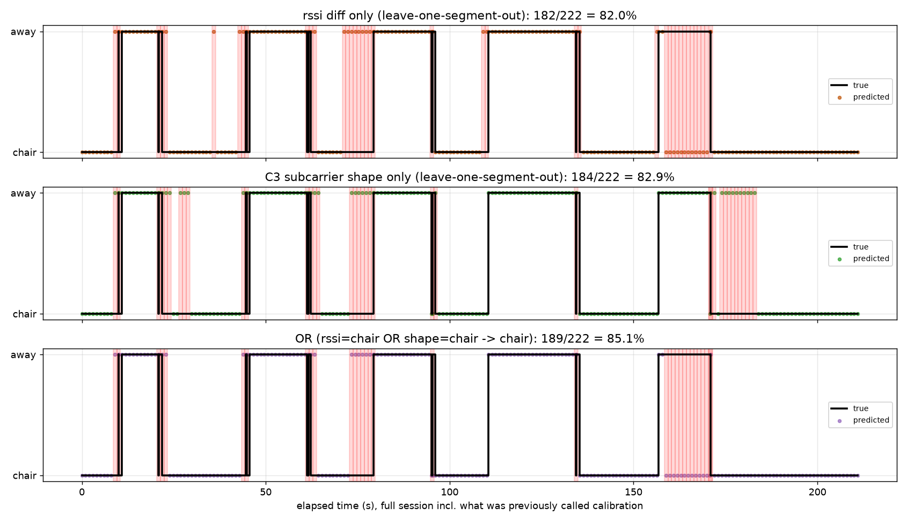

  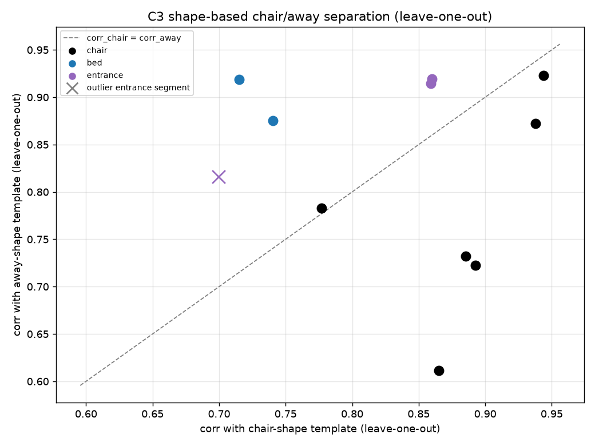

  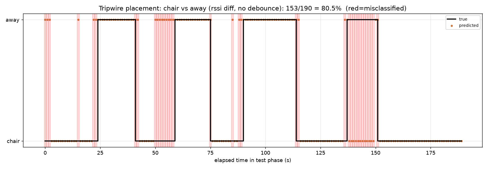

- **同一機種3台（M5Stack ATOM Lite）でも移動方向がrssiの移動平均だけで判別できた——diff_scoreに次ぐ第2の方向判定手段（#21、2026-09-03）**：NanoC6の採用断念（handoff.md参照）を受けて新規調達したATOM Lite 3台（ゾーンノードA・トリップワイヤーB/C）で、初の実機検証を行った。**疎通確認・チップ非依存の再確認は想定通り**（3台とも同一機種でMAC識別が機能、静止時rssi・振幅にチップ間差なし）。本題は移動平均の効果：トリップワイヤーB・Cの`diff_score`（サブキャリア0〜50帯の要素ごと差分平均）は常時ノイズ床が高く生データでは移動タイミングが視覚的に埋もれていたが、**1秒移動平均をかけるとB・Cのrssiに各タップ時刻と同期した一時的な谷が新たに見えるようになった**。この谷の発生順序（どちらが先に谷を作るか）を4回の移動イベントで確認したところ、**椅子→玄関では常にB→Cの順、玄関→椅子では常にC→Bの順**と、見取り図上の物理配置と完全に一致（4/4）。#17・#18・#20cで確立していた「乱れの順序で移動方向がわかる」という知見自体は既知だったが、**これまでdiff_score（サブキャリア乱れ）でしか確認していなかった同種の効果が、rssiの移動平均という別指標でも成立する**ことが新たにわかった——ノードの設置場所やAPとの距離によって「どちらの指標が効くか」が変わる可能性があり、両方を監視しておく価値がありそう
  - 時間差そのもの（谷が何秒早いか）は0.03〜4.3秒とばらつきが大きく、tap#3だけ-4.29秒と外れていた。**「順序」は4/4で頑健だが、「何秒前に通過したか」という定量値はタップの遅延（センサーがアプリのタップより先に反応する、#19bで既知の現象）の影響を受けやすく、そのままでは信頼できない**
  - トリップワイヤーB・Cの`diff_score`ノイズ床がなぜ常時高いか（ルーターに近い設置=rssi-40〜-45台と相関している可能性）は未検証のまま残っている

  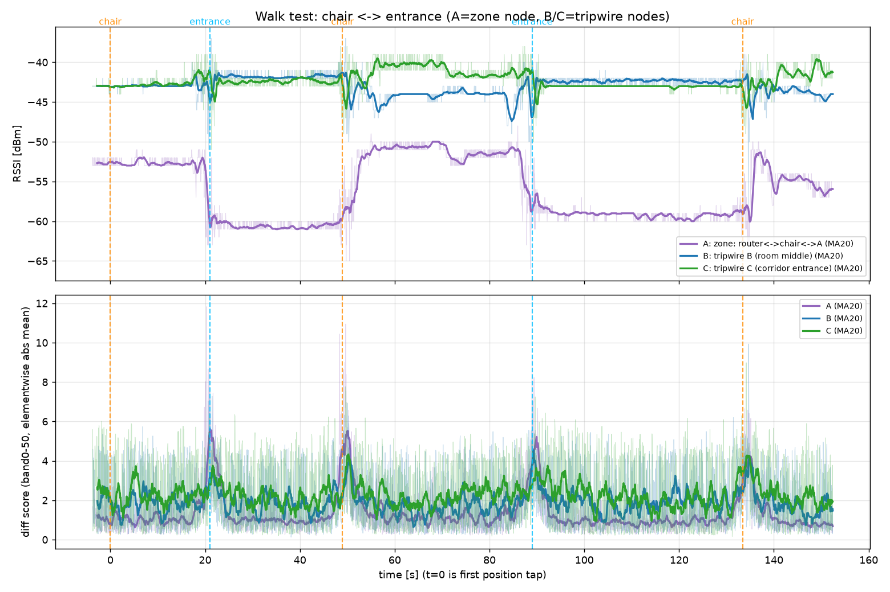

- **元祖ESP32のCSIハードウェアは「AP接続(アソシエート)済み」であることが必要条件——ただし第三者デバイスのCSIはAP接続していてもほぼ拾えない（#22、2026-09-03）**：SpecificDeviceCSI（TX/RX分離、公式esp-csiのcsi_send/csi_recvを移植）の初実装で、AP非接続+promiscuousモードの構成を8パターン切り分けても`esp_wifi_set_csi_rx_cb`のコールバックがほぼ一度も発火しなかった（promiscuous自体の生受信は完璧、TXの送信レート100Hzとほぼ一致して受信できているのにCSIだけ0）。試したのはチャンネル固定、HT20/HT40、promiscuous有効化の前後順序、トラフィック再起動、`platform`のバージョンアップ（espressif32 6.13.0→7.1.0）、ブロードキャスト→ユニキャスト——いずれも変化なし。espressif公式issue [esp-csi#247](https://github.com/espressif/esp-csi/issues/247)の症状（元祖ESP32はCSI有効化前から続くトラフィックのCSIを取りこぼす）と一致するが、記載の対策も効かなかった。**最後に試したTX/RX両方を実家WiFi APに接続した状態を維持する構成で、初めてCSIコールバックが動き出した**（毎秒約23回）——「未接続状態ではCSIがほぼ機能しない」という仮説を実証。しかし喜べたのはそこまでで、**発火したCSIコールバックの送信元MACの大半は接続先AP関連の実在デバイスで、TXから送り続けている数千パケットのうちTX由来と確認できたのはわずか6件**だった。つまり**元祖ESP32のCSIハードウェアは「現在アソシエート中のBSSIDに紐づくフレーム」を優先的に処理する設計と考えられ、AP接続していても未アソシエートの第三者デバイス（TXのような）からの直接パケットはほぼ拾えない**。この制約はSpecificDeviceCSIだけでなく、同じく「AP接続したまま他デバイスのトラフィックからCSIを取る」ことが前提のInterDeviceCSI（4.2）にも及ぶ可能性が高い（未検証）。公式ドキュメント・調査した複数issueのどこにも明記されておらず、実機検証で初めて確認できた制約——**このプロジェクトの主力機（AtomS3 Lite=ESP32-S3、XIAO C3）ではこの制約自体が起きない可能性がある**（公式のCSI性能ランキングでもESP32無印は最下位、S3/C3はより新しい世代）ので、次に検証するなら手持ちのS3/C3で同じ構成を試す価値がある

## 未解決・注意点

- 初期の単体検証（#1〜#7）は各条件とも試行回数が1回ずつで、録画時間もバラバラ（377〜1450+サンプル）。#11以降は2ノード・複数サイクルでの検証が中心になり再現性の確認も進んだが、#14・#18の経路遮蔽仮説の直接検証は依然1回きりなので、複数回の再現性確認は引き続き課題
- #3（座っている）のRSSIグラフには、サンプル200付近で-53dBmから-58dBmへの明確な段差がある。記録中に無意識に姿勢を変えた可能性が高いが未確認
- `avg_amp`の標準偏差は#3〜#5と#7で大きく異なる（2.63 vs 0.35）。フィルタは無関係（100%通過のため）なので、椅子の位置・向き・APが選んだ変調方式など、他の条件差による可能性が高い。原因は特定できていない
- **AP側の共通ドリフトに注意（#16, #17で判明）**：複数ノードのrssi/CSIが、物理的な変化がなくても数分〜十数分のスパンで同時に同方向へシフトすることがある（レート制御やチャンネル状況などAP側要因と推定）。単一ノードの絶対値だけで結論を出さず、複数ノードの相対関係（差分）や同時記録での比較を優先すること
- **トリップワイヤー配置のdiff_scoreノイズ床が常時高い（#21）**：ルーターに近い（rssi-40〜-45台）位置に置いたATOM Lite2台（B・C）は、サブキャリア0〜50帯のdiff_scoreが静止時でも2〜6と高止まりし、移動時ピーク（5〜12）との差が視覚的に埋もれた。ルーター近接による信号強度・環境ノイズの多さが原因かは未検証

## 解決済み（参考記録）

- ~~XIAO C3が示したrssi急上昇（#8）の再現性確認~~ → **解決**：#11でクリーンな機体（AtomS3・XIAO C3）を使って2サイクル再現。遠いノードが在室/不在で持続的にrssiシフトすることを確認済み
- ~~経路遮蔽仮説（#13）の直接検証~~ → **支持する結果を確認（#14, #18）**：AtomS3をベッド↔ルーター直線上へ再配置、さらにC3を椅子↔ルーター中間点へ再配置したところ、いずれも仮説を支持する結果が出た。「ノード設置場所はルーターとの直線上に監視したいゾーンが来るように」という実用上の設置指針として活用中
- ~~ノード間rssi差分を主特徴量として活用する検討~~ → **有効性を確認（#17）**：`rssi(C3)-rssi(AtomS3)`が絶対値より状態分離が明確で、AP側の共通ドリフト（#16）も打ち消すことを確認。ただしAtomS3がトリップワイヤー化した#20b以降、この効果は「両ノードがそれぞれゾーン依存の変化を持つ場合にのみ機能する」という前提条件付きだったことも判明（#20b）
